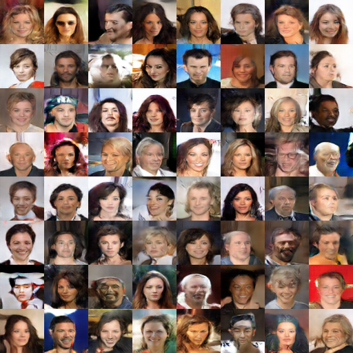

## DCGAN with TensorFlow
- TensorFLow implementation of [Unsupervised Representation Learning with Deep Convolutional Generative Adversarial Networks](https://arxiv.org/abs/1511.06434) which is a stabilize GAN by certain architectural constraints

- Architecture guidelines for stable Deep Convolutional GANs:
  - Replace any pooling layers with strided convolutions(discriminator) and fractional-strided convolutions(generator)
  - Use BatchNorm in both the generator and the discriminator
  - Remove fully connected hidden layers for deeper architectures
  - Use Relu activation in generator for all layers except for the output, which uses Tanh
  - Use LeakyReLU activation in the discriminator for all layers

- Generator architecture

  

- Usage

  - Download dataset CelebA from [here](http://mmlab.ie.cuhk.edu.hk/projects/CelebA.html)
  - Train the model: `python main.py`

- Training details

  

  

  

- ~~To ensure that `d_loss` do not go to zero during the training, I run generator 5 times every discriminator updating. Although the `d_loss` will not be close to 0, the quality of the generated images is very bad.~~

- ~~Because I do not have GPUs to train all the training set now, so I just test the code with several samples on my MacBook Air. More training results will be updated later.~~

- Result

  - After 5th epoch

    

  - After 10th epoch

    

  - After 20th epoch

    

- The code borrowed from [here](https://github.com/taki0112/DCGAN-Tensorflow)